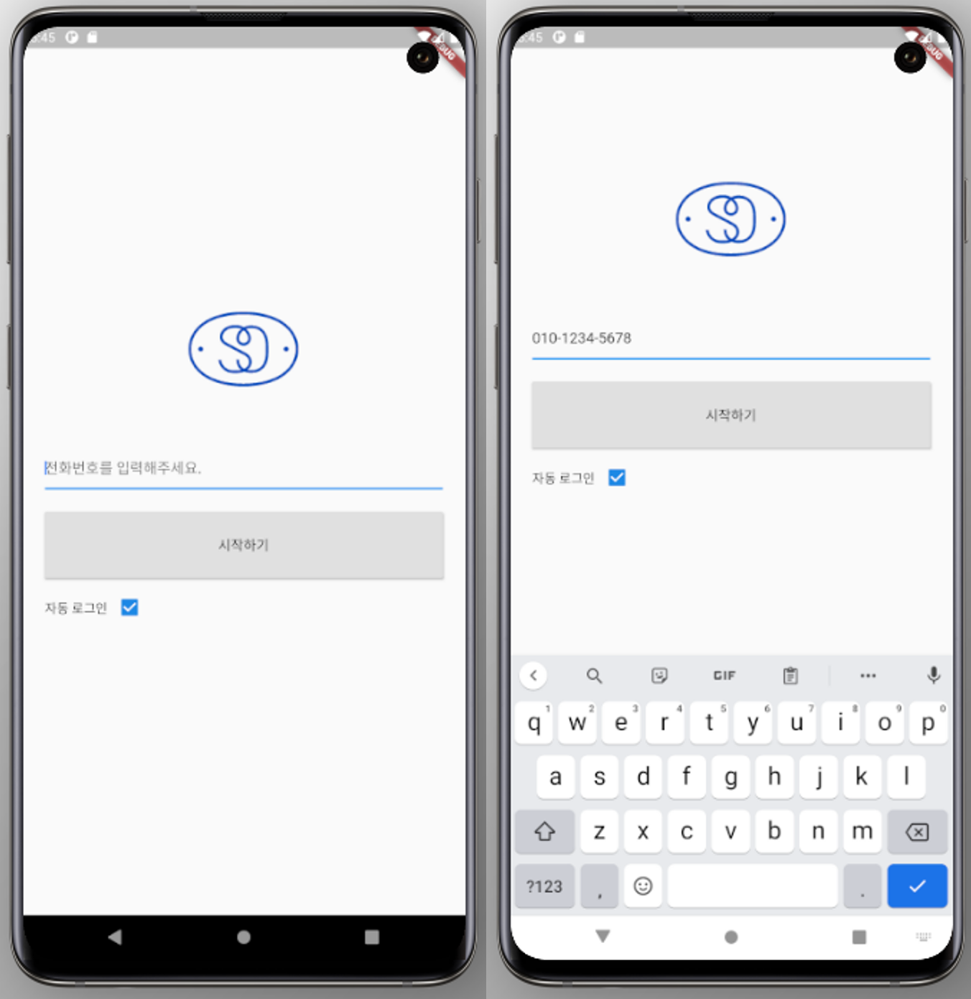
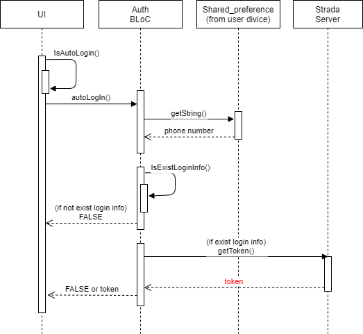
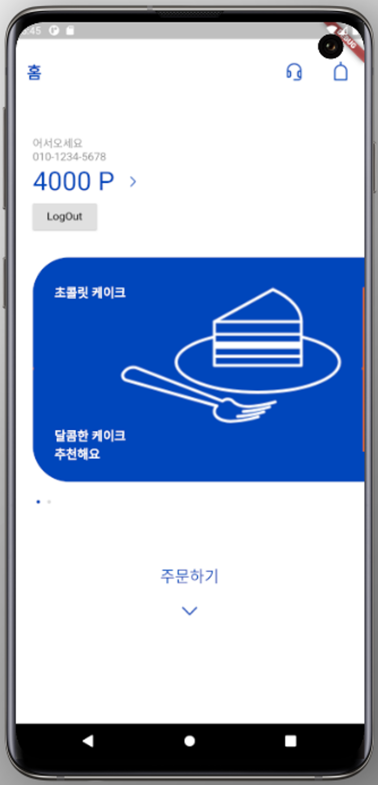
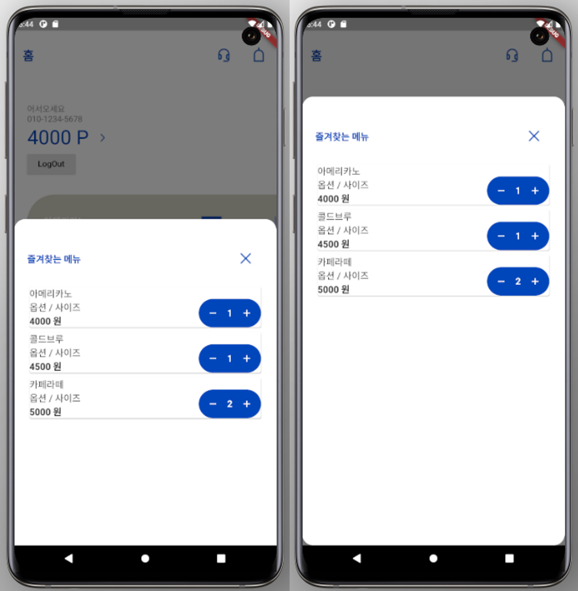
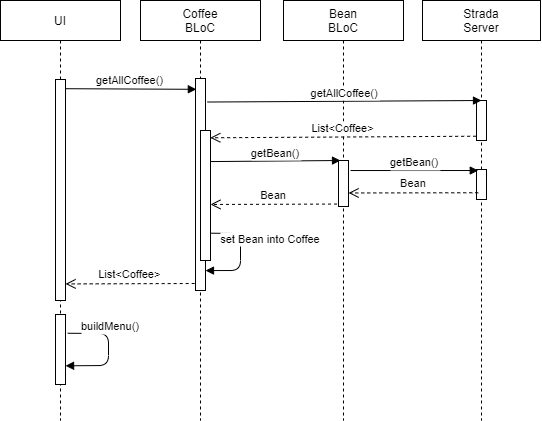

# Overview

# Screens

## Splash

#### UI

***gif 캡쳐해서 추가***

## Log In

### 1. direct Log-in

#### UI

***gif 캡쳐해서 추가***

#### Sequence Diagram

### 2. Auto Log-in

#### UI

***gif 캡쳐해서 추가***

#### Sequence Diagram

## User Profile

#### UI

***gif 캡쳐해서 추가***

## Banner 

#### UI

***gif 캡쳐해서 추가***

### Swifing

## Menu

#### UI

**gif 캡쳐해서 추가**

#### Sequence Diagram

- Coffee, Bean 통신 설명
